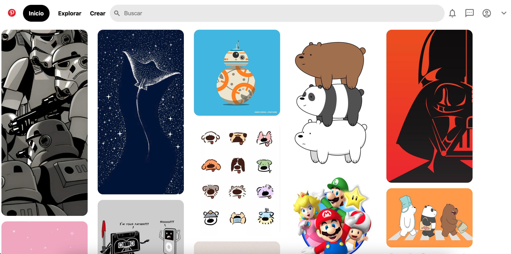

# Clon de Pinterest con HTML y CSS
Este proyecto es un clon de la interfaz de usuario de Pinterest, creado puramente con HTML y CSS.

Se enfoca en replicar la apariencia visual de Pinterest, ofreciendo una experiencia de navegación similar con un diseño responsive y funcionalidades básicas.

### Características

* **Diseño Responsive:** Adaptable a diferentes tamaños de pantalla para una experiencia de usuario óptima en dispositivos móviles y de escritorio.

* **Interfaz de Usuario Intuitiva:** Inspirada en Pinterest, con una navegación fácil y accesible.

* **Interacciones Dinámicas:** Efectos visuales para elementos interactivos como botones y enlaces.

* **Iconografía y Estilos Modernos:** Uso de la biblioteca de íconos de Material Design y estilos CSS modernos para una apariencia contemporánea.

### Tecnologías Utilizadas

* **HTML5:** Para la estrcutura básica del sitio.

* **CSS3:** Para el diseño y el estilo, incluyendo _flexbox_ para un diseño responsivo y efectos de hover.

### Vista Previa del Proyecto

### Contacto

Si te gustaría invitarme a colaborar en un proyecto, contáctame por [LinkedIn.](https://www.linkedin.com/in/ileana-suzel-moreno-guerrero-992a08129/)
